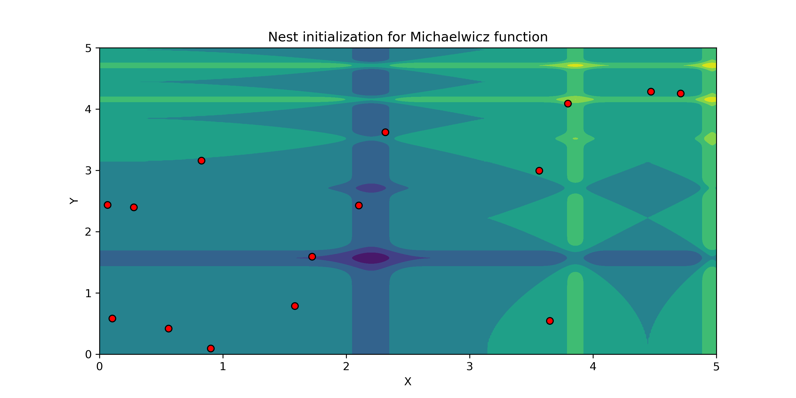
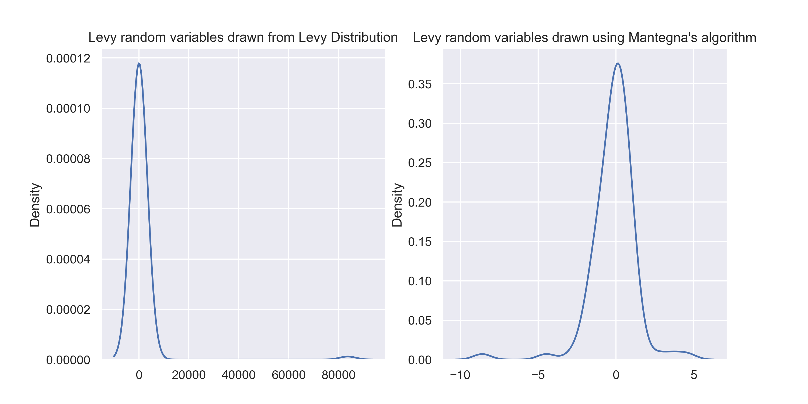
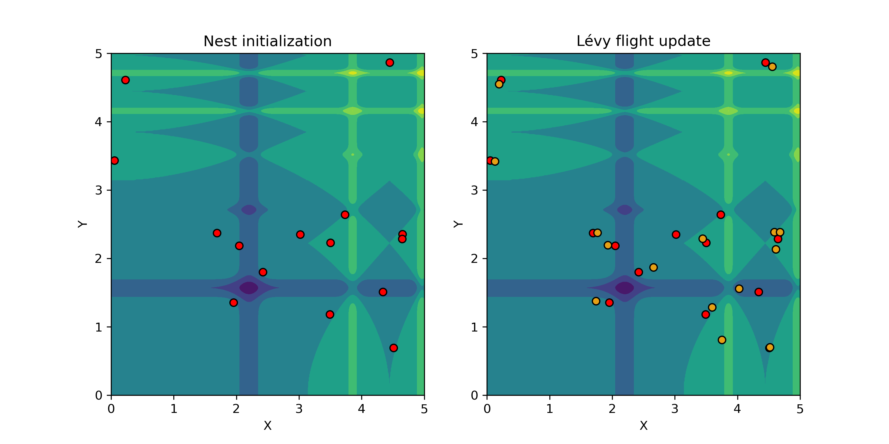
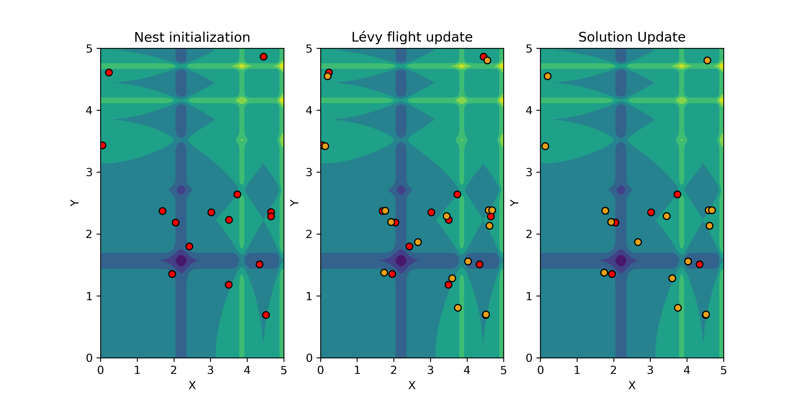
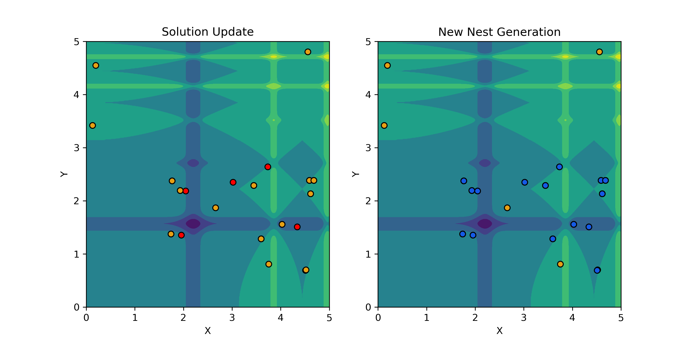
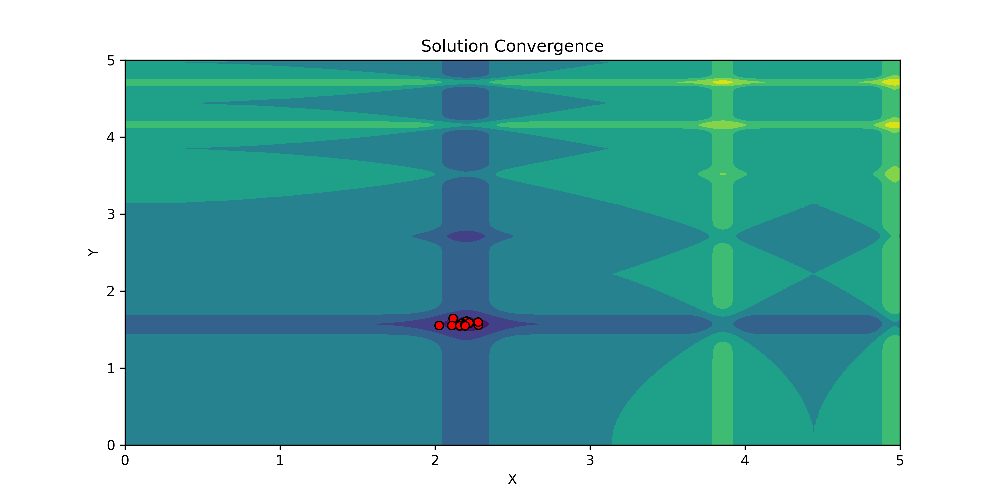

<script
  src="https://cdn.mathjax.org/mathjax/latest/MathJax.js?config=TeX-AMS-MML_HTMLorMML"
  type="text/javascript">
</script>


## Table of Contents 
* [What is Cuckoo Search](#intro)
  * [Brood Parasitism and PSO](#broodpso)
  * [Lévy Flights](#levyflights)
* [Implementation of Cuckoo Search](#csimple)
  * [Initialization with nests & eggs](#init)
  * [Random walks with Lévy flights](#rwalks)
  * [Brood discovery: The countermeasure](#countermeasure)
* [Analysis & Results](#a&r)
* [Conclusion](#cnclsn)


### What is Cuckoo Search <a name="intro"></a>
Cuckoo Search (CS) is a particle swarm optimization (PSO) algorithm developed by Xin-She Yang and Suash Deb in their seminal paper titled [_Cuckoo Search via Lévy Flights_](https://ieeexplore.ieee.org/abstract/document/5393690). The algorithm belong to a category of algorithms known as **Nature Inspired Optimization** (NIO) algorithms, algorithms that use the dynamics of species interaction in the nature to solve optimization based problems. 

Cuckoo Search algorithm is built on top of two key ideas that are central to the functioning of the algorithm; **Brood Parasitism** and **Lévy Flights**. 

#### Brood Parasitism and PSO <a name="broodpso"></a>
The first idea behind CSO is the concept of Brood Parasitism, a phenomena in nature that can be best summarized with this one excerpt:

> _When you’re an exhausted parent and you wish you had some time to just live your own life, you might secretly fantasize about taking your kids over to your neighbor, dropping them off, and saying, “Here. These are YOURS now. I’ve got better things to do… like sleep.” Now I know you’d never do that, of course. But there are many birds out there that have no qualms about dumping their offspring into the care of a neighbor or even a complete stranger._
> 
> -- Ivan Phillipsen, [What Is Brood Parasitism in Birds?](https://www.scienceofbirds.com/blog/what-is-brood-parasitism-in-birds)

Essentially, **Brood Parasitism relies on the idea of advancing the genetic fitness of a brood species using the resources of the host species**. Cuckoo birds are famous for using this evolutionary strategy as they will lay their eggs in the nest of host bird and the host bird bears the expenses of raising the cuckoo chick.The evolutionary strategy sounds effective since the cuckoo bird has little efforts to put for raising its chicks, but it is not a foolproof strategy. Host birds do have countermeasures against such brood parasitic behaviour such as to destroy the parasitic egg or to completely abandon the nest and start over fresh. 

This idea is an important concept studied in evolutionary game theory under the name **Evolutionary Arms Race** and this idea persists to ensure that in a competing environment, a given set of adversaries always have a set of evolving advantages against each other. How this idea shows up in CSO will be shown further ahead

#### Lévy Flights <a name="levyflights"></a>
The second idea behind CSO is the use of a randomization procedure that helps in generating new random solutions using Lévy Flights. 

Lévy Flights, named after the French mathematician Paul Lévy, are a class of random walks where the step lengths are randomly drawn from a distribution that has a power law tail. These distributions are known as Lévy distributions or stable distributions, where the length $l$ of the steps is distributed as a power law, $P(l) = l^-\mu$ where $1 < \mu \leq 3$.

What makes Lévy Flights interesting is the fact that it has been observed in the nature to understand foraging patterns in a number of species of animals and insects, notably ant, bumble bees and avian birds. In the implementation of CSO, Lévy Flights act as the step size generator where each time a cuckoo bird is spawned, its next flight path is determined by Lévy flights. 

### Implementation of Cuckoo Search <a name="csimple"></a>
CSO is a metaheuristic algorithm that is implemented using the following pseudocode

```
#CSO Algorithm Pseudocode

Set an objective function f(x)
Generate initial population of n hosts, Xi

while (t < MaxGeneration) or (StopCriterion):
  Select a random cuckoo bird 
  Generate a solution using Lévy flights (Global random walks)
  Evaluate its solution quality, f_levy
  Choose a random nest among n, f_random_nest 

  if f_random_nest < f_levy:
    Repace f_random_nest with f_levy
  end 
  
  A fraction (p_a) of worst nests are abandoned
  Generate new nests using Lévy flights (Local random walks)
  Keep the best solutions
  Rank the solutions and find the current best 
  Update t <- t + 1
end while 
```

CSO operates under three simple rules that are as follows: 

1. Each cuckoo bird will lay an egg in a randomly chosen nest 
2. The nests that carry the best eggs will hatch and continue their species forward to the next generation
3. The host birds will discover the cuckoo eggs in their nest with a detection probability $p_{d} \in (0,1)$. If this happens, the host bird can either abandon the nest and create a new nest

The three steps described above continue to occur in an iterative fashion until the solutions converge to the optimum. When implementing CSO, **each egg in a nest represents a solution and each cuckoo lays one egg that represents one solution**. This would be done to produce better solutions to replace the solutions that they improved upon, hence improving upon the solution in an iterative fashion.

To further make things simpler, **we also assume that each nest has one single egg only, hence one inidividual solution**. If a single egg is laid into the nest, then the nest, egg and the cuckoo become the same as a solution since each nest holds and egg and each egg holds a cuckoo. 

To demonstrate the power of CSO, we the Michaelwicz function to demonstrate CSO, the function being

$f(x,y) = -sin(x)sin^{2m}(\frac{x^2}{\pi})-sin(y)sin^{2m}(\frac{2y^2}{\pi})$

With the search space $x, y \in [0,5] \times [0,5]$ and the global optimum at $(x_{*},y_{*}) = (2.203,1.570), f_{*} = -1.8013$

#### Initialization of the nests & eggs <a name="init"></a>

To start using CSO for optimizing a given target function, we would first need to set up an initial solution that we wish to start from. Because CSO is a stochastic algorithm that uses randomness as a way to update its iterative solutions, initialization of a random solution is needed to begin the convergence process. 

The initial solutions are randomly generated from a random probability distribution, the solutions being of dimension $(n \times k)$, where $n$ is the number of nests that the function will be pre-populated with and $k$ is the number of dimensions across which the solution needs to be searched for. **In the original paper, the authors found $n$ to range between 15 and 40 for initializing nests that will sufficiently solve all optimization problems.** 

To demonstrate this on Michaelwicz function, a total of 15 nests were generated across 2 dimensions, $x$ and $y$, since the objective function produces the output in the $z$ dimension, hence our search space dimension $k = 2$. The generation of the random nests was done from a Uniform distribution of range $[l,h]$, where $l$ is the lower limit of the search space and $h$ is the upper limit of the search space

$$ X,Y \sim\mathcal U(l,h)$$ 

The initialized nests that were generated have been visualized below in the contour plot of Michaelwicz function. The red dots indicate the randomly initialized nests that were generated



#### Random walks with Lévy flights <a name="rwalks"></a>
Once the nests have been randomly initialized, the next step is to produce a new nest solution with the help of Lévy flights. CSO uses a balance of a local random walk and a global random walk, with: 

* Local random walks used to generate new nests and update existing nests for the next iteration 
* Global random walks for generating new solutions using Lévy flights

The global random walk is done using Lévy flights where each cuckoo bird will fly to a random nest in the search space and lay its egg. The global random walk for solution generation is defined as 

$$x_{i}^{t+1} = x_{i}^{t} + \alpha s(\lambda)$$

Where $\alpha, \alpha > 0$ is the step-size scaling factor to ensure that the step size generated from the Lévy distribution is not too large. The global random walk equation is an equation for a random walk and the generation of the step size is done with $s(\lambda)$, which produces a Lévy-stable random variable, the control parameter being $\lambda = 1.5$. The simulation of this stable random variable is done using Mantegna's algorithm to produce step sizes that come from a symmetric stable Lévy distribution

Mantegna's algorithm is used to generate stochastic random variables that follow a symmetric stable Lévy distribution. The algorithm uses random variables from two Gaussian distributions to create a third random variable that converges to a symmetric stable Lévy distribution. There are two reasons why Mantegna's algorithm is preferred for step size generation

1. **Finite Variance**: Using the Mantegna's algorithm generates a distribution that is bounded under finite variance. This is important since we do not want to generate values that can have infinite variance, leading to instability in the generation of random variables. 

2. **Fatness of  Tails**: The distribution generated using Mantegna's algorithm produces a fat tailed distribution that is not as extreme as the one generated from Lévy distribution. This is important as drawing random variables from a Lévy distribution could generate values that can be extremely large. This can create situations where numerical approximations have a difficult time reaching convergence and it can be controlled if the extremity of the tails can be controlled, which Mantegna's algorithm can do well.




Next, the local random walk is done to update the nests that were evaluted for function fitness by changing their coordinates in the search space. The local random walk is defined as 

$$x_{i}^{t+1} = x_{i}^{t} + \alpha s(\lambda) H(p_{a} - \epsilon) (x_{j}^{t} - x_{k}^t)$$

Where $x_{j}^{t} - x_{k}^t$ are two different solutions selected randomly by random permutation, $H(u)$ is the Heaviside function, $\epsilon$ is a random number drawn from a uniform distribution, and $s$ is the step size.

Once the random values are initialized, the next step is to generate a new pool of nests using Lévy flights, `f_levy`. As seen in the visualization below, the random walk update creates a new set of nests with updated coordinates. In the algorithm, this is the step where the cuckoo bird lays eggs in the nests and creates a new generation of species. In the `Lévy flight update` contour plot, the yellow coloured scatter dots represent the new nests generated by Lévy flights.



After the Lévy flight generates a new set of nests, the next step is to evaluate the newly generated nest solutions `f_levy` with the initialized nest solutions `f_random_nest`. In this step, an initialized nest is randomly selected and its function output is compared against the function output generated by a Lévy flight nest. If the solution is improved, then the nests are updated or else they stay the same. 



As observable in the `Solution update` contour plot, when the solution is improved, some of the initialized nests are replaced with the nests generated by Lévy flights. But once the solution has been updated with Lévy flights and the solution update is complete, how do we create a measure where these optimal solutions, the newly laid Cuckoo eggs, can be detected in order to improve the new solutions? 

#### Brood discovery: The countermeasure <a name="countermeasure"></a>

Once the solutions have been updated, the next step of the algorithm is to update the positions of the nests by removing a certain proportion of nests and generating new nests using local random walks. As mentioned previously, the local random walks are performed using the equation 

$$x_{i}^{t+1} = x_{i}^{t} + \alpha s(\lambda) H(p_{a} - \epsilon) (x_{j}^{t} - x_{k}^t)$$

Where $H(p_{a} - \epsilon)$ is the Heaviside function. The Heaviside function will produce a 0 if $(p_{a} - \epsilon) < 0$ else it will produce a 1, with the probability of detection $p_{a} = 0.25$. The stepsize function still stays there to create random Lévy flights to update the location of the nests. As visualized in the graph below, the local random walk creates a nest update but observe that the coordinates of the nest don't change. This is an expected behaviour since the coordinate update depends on the Heaviside function's input value being greater than 0 or not. 



The countermeasure approach here is taken by $p_a$ being 0.25, so one in every four nests will be abandoned or destroyed before the new iteration begins. The local random walks ensure that the generation of new nests creates sets of solutions that continue to improve over time. In the demonstration of the algorithm, the algorithm was run for 100 iterations 

